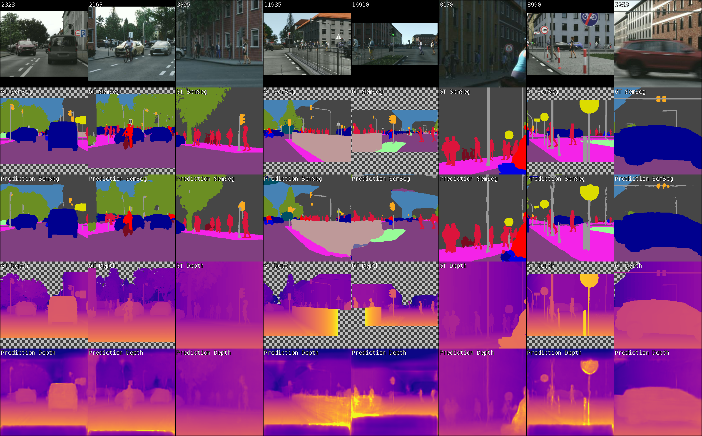

# DLAD Exercise 2 

Multitask Semantic Segmentation and Monocular Depth prediction for Autonomous Driving


 
This is a template project for the practical assignment #2 in Deep Learning for Autonomous Driving course:
https://www.trace.ethz.ch/teaching/DLAD

Please refer to the assignment PDF for instructions regarding the assignment scope, and training with 
Amazon Sagemaker in the cloud. 

---

\<INSERT A BRIEF VERSION OF YOUR REPORT HERE\>

---

Read below only if you wish to use the code in a standalone environment.

### Installation and Datasets

Create and activate a new virtual environment, and install python dependencies into it:
```bash
python -m venv ~/venv_dlad_ex2
source ~/venv_dlad_ex2/bin/activate
pip install .
```

The dataset link will be made available in the assignment PDF handout.

### Quick Start Training

Only two command line arguments are required to begin training immediately: 
- `log_dir`: path to directory which will be filled with experiment artifacts: logs, tensorboard files, model 
checkpoints, etc.;
- `dataset_root`: path to MiniScapes dataset

To train a model use the following command line template:
 ```bash
CUDA_VISIBLE_DEVICES=<gpu_ids> python -m mtl.scripts.train <arguments>    
```

Example:
```bash
CUDA_VISIBLE_DEVICES=0 python -m mtl.scripts.train 
    --log_dir /home/ubuntu/out_dlad_ex2 
    --dataset_root /home/ubuntu/miniscapes/
```

### Visualization with TensorBoard

Each experiment writes TensorBoard logs into the path, specified by `log_dir` command line argument. 

Run TensorBoard with the following command in a separate shell:
```bash
tensorboard --logdir <PATH> --port <PORT>
``` 

`PATH` can either be a single experiment log folder, or a parent folder with multiple nested experiments.

`PORT` value should be chosen such that it is not occupied by other services, e.g. 10000.
To access tensorboard, navigate with the browser to machine URL with selected port, e.g. http://localhost:10000 (if 
running locally), or http://URL:10000 (if running remotely). 

When running tensorboard server on a remote machine, which does not expose the selected port online, any port forwarding 
technique can help:

- SSH. To forward a remote port to localhost via ssh, just create a separate ssh session by running 
`ssh -L <PORT>:localhost:<PORT> <URL>`, then you can access localhost:port URL locally while that session is up.
- NGROK. Register at www.ngrok.com (free), then follow instructions - this way TensorBoard can be accessed even by a 
smartphone.

### Command Line Keys

Full description of all command line keys can be found in [config.py](mtl/utils/config.py) or by running  
`python -m mtl.scripts.train --help`
